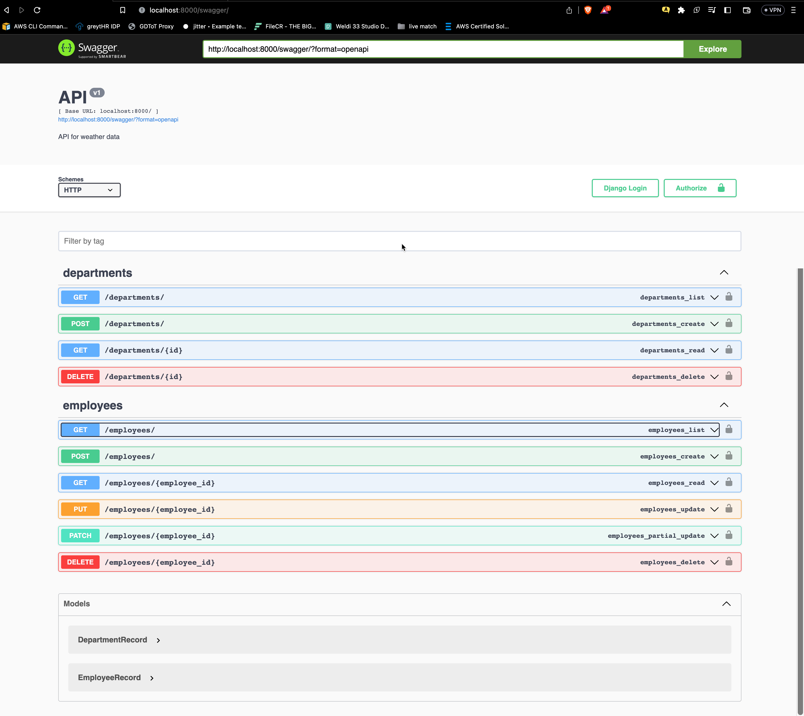
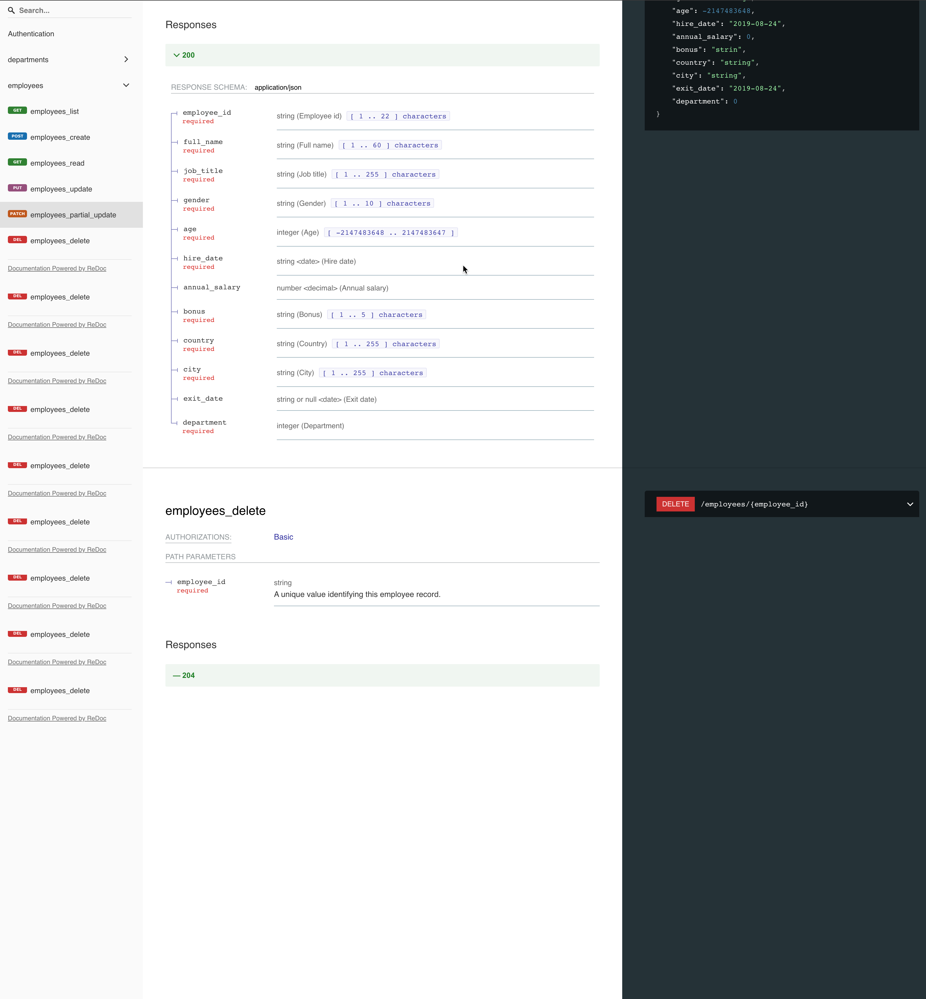

# Employee Data API
API for managing employee and department records.
--- 
## Technologies Used

- Python
- Django
- Django REST Framework
- Swagger/OpenAPI
---

## docker-compose

1. Clone the repository
    ```bash
    git clone <repo_url>
    cd <project_name>
    ```

2. Build and run the application using Docker Compose. This will automatically download the required dependencies.
    ```bash
    docker-compose up
    ```

3. Ingest the Employee data from wx_data/employee_data.csv into the database:
    ```bash
    docker exec -d app python manage.py runscript ingest
    ```
---
## Installation(Local)

1. Clone the repository:

    ```bash
    git clone <repo_url>
    cd <project_name>
    ```

2. Install `pipenv` if not already installed:

    ```bash
    pip install pipenv
    ```

3. Install the required packages and create a virtual environment:

    ```bash
    pipenv install
    pipenv shell
    ```

4. Create migrations for the database tables:

    ```bash
    python manage.py makemigrations
    ```

5. Run the database migrations:

    ```bash
    python manage.py migrate
    ```

6. Ingest the Employee data from (wx_data/employee_data.csv) into the database:

    ```bash
    python manage.py runscript ingest
    ```

7. Start the development server:

    ```bash
    python manage.py runserver
    ```

8. Navigate to `http://localhost:8000/swagger/` to view the Swagger documentation for the API.


--- 
## API Endpoints


The following endpoints are available:

### Employees
* `GET /employees/` - Retrieve a list of all employees
* `POST /employees/` - Create a new employee
* `GET /employees/<employee_id>/` - Retrieve an employee by ID
* `PUT /employees/<employee_id>/` - Update an employee by ID
* `PATCH /employees/<employee_id>/` - Partially update an employee by ID
* `DELETE /employees/<employee_id>/` - Delete an employee by ID
### Departments
* `GET /departments/` - Retrieve a list of all departments
* `POST /departments/` - Create a new department
* `GET /departments/<pk>/` - Retrieve a department by ID
* `DELETE /departments/<pk>/` - Delete a department by ID

### Filters
The `/employees/` endpoint supports filtering on the following fields:

- job_title
- gender
- country
- city
- department_id
- Annual_Salary
- order
- search

To filter on these fields, use the following query parameters:

- job_title
- gender
- country
- city
- department_id
- Annual_Salary__gt - Greater than
- Annual_Salary__lt - Less than

- `order`: Order the list of employees by one or more fields. You can order by any field in the employee record, using the format field or -field (for descending order). For example, to order by annual salary, you can use the query parameter `order=annual_salary`.
- `search`: Search the list of employees for a keyword or phrase. You can search by any field in the employee record, using the format ^field=value (for exact match) or field__icontains=value (for partial match). For example, to search for employees with job title "Manager" or country "USA", you can use the query parameter `search=^job_title=Manager,country__icontains=USA`.

Example request:

```
GET /employees/?job_title=Controls%20Engineer&gender=Male&country=United%20States&city=Austin'
```

Example response:

```json
{
  "count": 1000,
  "next": "http://localhost:8000/employees/?page=2",
  "previous": null,
  "results": [
    {
      "employee_id": "E02002",
      "full_name": "Kai Le",
      "job_title": "Controls Engineer",
      "gender": "Male",
      "age": 47,
      "Hire_Date": "2022-02-05",
      "Annual_Salary": "$92,368 ",
      "Bonus": "0% ",
      "country": "United States",
      "city": "Columbus",
      "exit_date": null,
      "department": 1
    },
    ...
  ]
}
```

### `/departments/`

The response includes the following fields:

* `id`: The unique ID of the record
* `name `: name of department


Example request:

```
GET /departments
```

Example response:

```json
[
{
  "id": 1,
  "name": "Engineering"
}
    ...
    ...
]
```


---


## API Documentation

This project provides an API for accessing Employees data. The API is documented using the OpenAPI 3.0 specification and can be accessed using Swagger and ReDoc.

To access the Swagger documentation, start the Django development server and navigate to `http://localhost:8000/swagger/`. This will display the Swagger UI, which allows you to interact with the API and view its documentation.

To access the ReDoc documentation, start the Django development server and navigate to `http://localhost:8000/redoc/`. This will display the ReDoc UI, which provides an alternative view of the API documentation.


---


## Screen Shots



